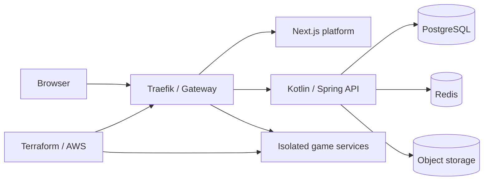

# ⚠️ ATTENTION

If you only want to see the highlights, please go directly to the [`/highlights`](./highlights/) folder.

# Game Platform Architecture Showcase

A redacted architecture overview of a browser-based multiplayer game platform.

This repository shows boundaries, technology choices, deployment shape, and engineering practices. Gameplay code, game content, assets, private prompts, production identifiers, and secrets are intentionally excluded.

## Architecture

## Stack

- Web: Next.js, React, TypeScript, pnpm
- Services: Kotlin, Spring Boot
- Data: PostgreSQL, Redis, Flyway
- Runtime: Docker Compose, Kubernetes/Kustomize, Traefik
- AWS: EC2/k3s, ECR, S3-compatible storage, SSM Parameter Store
- Quality: GitHub Actions, Playwright, linting, type checking, automated tests
- Workflow: redacted AI-agent skill definitions under `.agents/`

## Current state

The private application is deployed for testing on a temporary public IP. DNS setup is in progress. The next milestones are a payment gate and migration to a proper production-grade setup.

## Public boundary

The private repository remains the source of truth. This repository is an intentionally incomplete, non-runnable architecture showcase.
