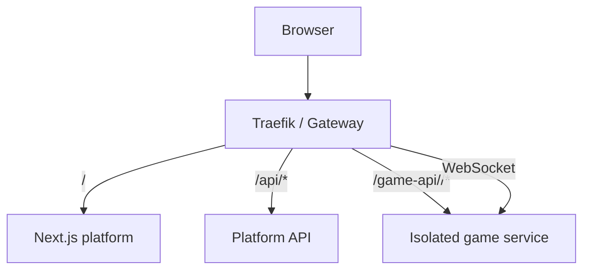

Every browser request uses one public origin

Traefik routes the web app, platform API and isolated game services without exposing service ports to the browser. HTTP and WebSocket traffic use the same contract.

