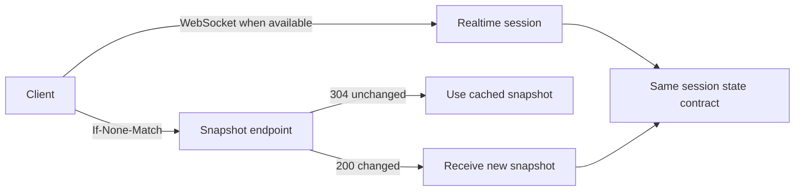

Realtime state can move from polling to WebSockets without changing the snapshot contract.

When polling is still used, ETags avoid sending an unchanged snapshot again.

```mermaid
flowchart LR
    Client[Client] -->|WebSocket when available| Realtime[Realtime session]
    Client -->|If-None-Match| API[Snapshot endpoint]
    API -->|304 unchanged| Cache[Use cached snapshot]
    API -->|200 changed| Fresh[Receive new snapshot]
    Realtime --> State[Same session state contract]
    Fresh --> State
```
