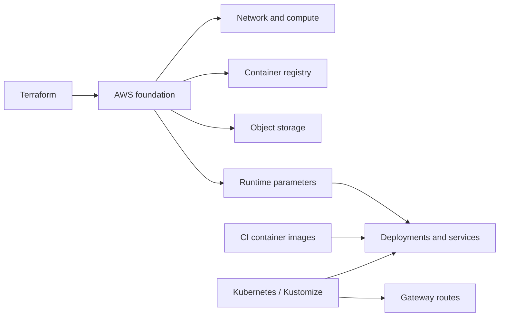

Terraform owns the cloud foundation. Kubernetes owns the application workloads.

This keeps infrastructure, deployment shape and runtime configuration separate.

```mermaid
flowchart LR
    Terraform[Terraform] --> AWS[AWS foundation]
    AWS --> Network[Network and compute]
    AWS --> Registry[Container registry]
    AWS --> Storage[Object storage]
    AWS --> Parameters[Runtime parameters]
    Kustomize[Kubernetes / Kustomize] --> Workloads[Deployments and services]
    Kustomize --> Gateway[Gateway routes]
    Images[CI container images] --> Workloads
    Parameters --> Workloads
```
