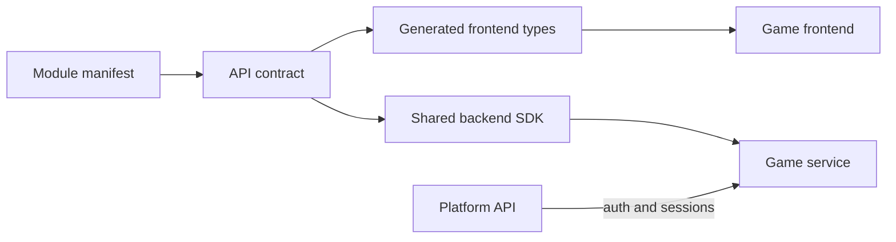

The platform and each game service meet through explicit contracts.

Manifests, API schemas and shared SDKs keep authentication, sessions, commands and state consistent across independently deployed modules.

